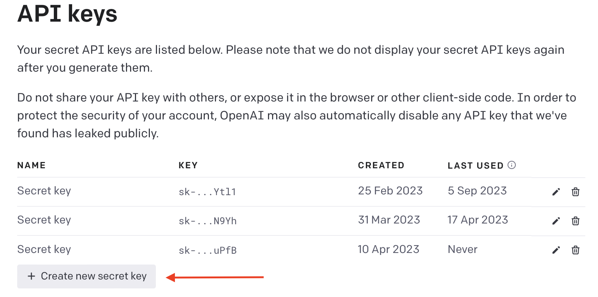
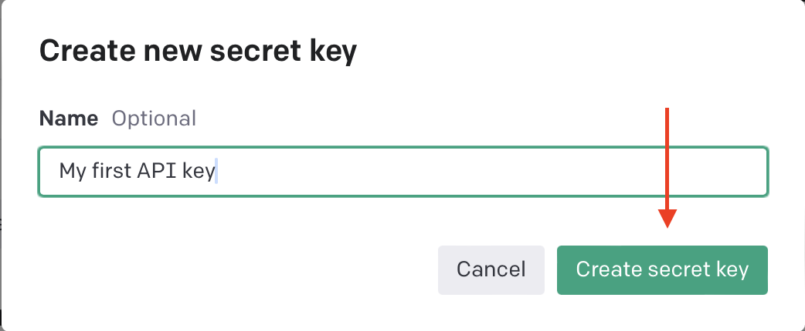
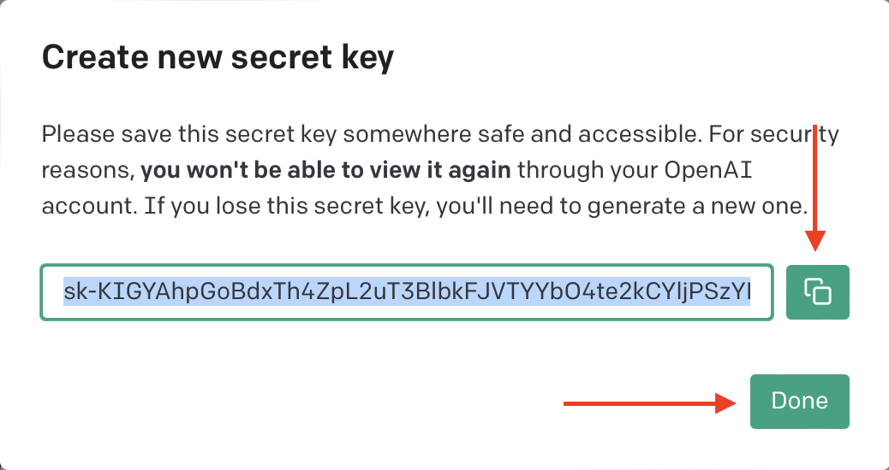
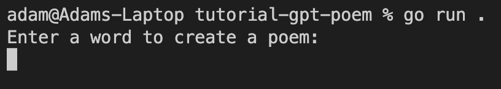
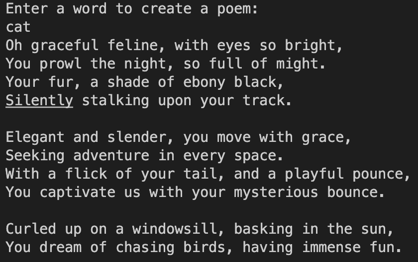

# Creating your first AI app

Published: September 5, 2023

This article will guide you through creating your first application that uses AI, to see just how simple yet powerful it is.

We will create an application that takes user input and generates a short poem using that input. Without AI, this would be a very complex task.

For this article we’ll create the application in Go and use one of OpenAI’s GPT models but you can use a similar approach in any language. 

# Step 1

Create a basic app to get user input.

Create a new Go application and add the following code to the `main()` function to get user input.

```go
// Read user input
var input string
println("Enter a word to create a poem: ")
_, err := fmt.Scanln(&input)
if err != nil {
	fmt.Println(err)
}
```

# Step 2

Add an OpenAI library.

Instead of writing all the code to interact with OpenAI's APIs ourselves, we will use a Go module called **[go-openai](https://github.com/sashabaranov/go-openai)**. This module saves us from rewriting a lot of communication code with OpenAI's API and allows us to reuse it in multiple projects.

Add the library using the following terminal command

```bash
go get github.com/sashabaranov/go-openai
```

# Step 3

Now, let's get to the interesting part! We will add the code that generates the poem for us.

The code below makes a request to OpenAI's API and performs what is called "ChatCompletion". When using a model such as GPT, we often structure our input in the form of a chat. We can provide a series of messages between a "System" and a "User" to provide context. Then, we ask the model to generate the next message in the conversation.

In the example below, we provide only one message, "Write a poem about a...", as our use case is simple. Then, we ask the model to generate the next message in the conversation, which will be our poem.

Paste the code below under our preview code from Step 1.

```go
// Create an instance of the OpenAI client
c := openai.NewClient("YOUR_API_KEY")
ctx := context.Background()

// Create a chat completion request
req := openai.ChatCompletionRequest{
	Model:     openai.GPT3Dot5Turbo,
	MaxTokens: 100, // This is the number of tokens used to generate the poem
									// The higher the number, the longer the poem
	// This is a list initial messages to give the model context
	// The more messages, the more context the model has to generate the poem
	// In this case, we only need one message
	Messages: []openai.ChatCompletionMessage{
		{
			Role:    openai.ChatMessageRoleSystem,
			Content: "Write a short poem about a " + input + ":\n",
		},
	},
}

// Send the request to the API
resp, err := c.CreateChatCompletion(ctx, req)
if err != nil {
	fmt.Println(err)
}

// Print the poem
fmt.Println(resp.Choices[0].Message.Content)
```

# Step 4

The penultimate step is getting an API key to use to authenticate with OpenAI’s API. To do this head over to [https://openai.com](https://openai.com/) and create an account. Then, head to the API key management page at [https://platform.openai.com/account/api-keys](https://platform.openai.com/account/api-keys). 

Press the “Create new secret key” button.



Enter a name for your new key and press “Create secret key”.



Finally, press the copy button and then the “Done” button. (FYI, if you’re wondering, this key no longer exists 😂)



Now you just need to replace the `YOUR_API_KEY` string in the code from Step 3 with your copied key.

# Step 5

The last step is to run our code and test it out.

Run the code using the following command.

```go
go run .
```

And you should see your prompt.



Enter a word and hit return to generate your poem.



# Summary

I hope you found this article helpful in exploration of GPT and its capabilities. In addition to the code provided in the article, you can find the full code on my GitHub account at [https://github.com/farmerajf/tutorial-gpt-poem](https://github.com/farmerajf/tutorial-gpt-poem).